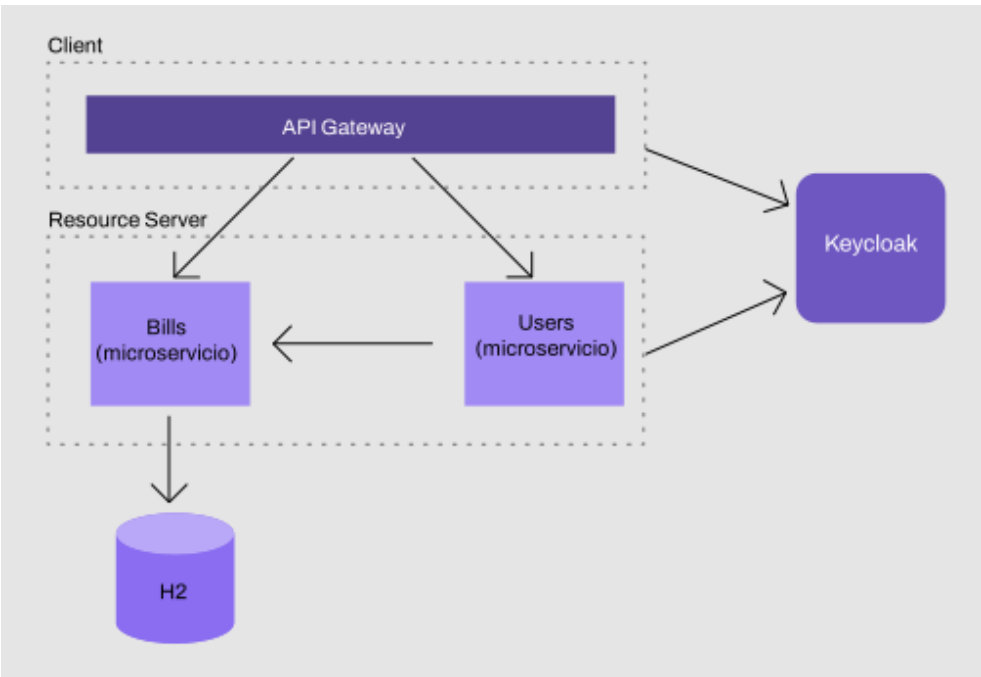

# Microservicio de Facturación (Bills Service)

Este repositorio alberga el microservicio encargado de gestionar las facturas en un sistema de e-commerce. Permite la creación, búsqueda y otras operaciones clave relacionadas con las facturas de los clientes.

## Diagrama del Sistema

## Configuración de Seguridad

### En KeyCloak:

- Creación de un cliente confidencial para la autenticación.
- Creación y asignación del rol "USER" a los usuarios.
- Configuración de al menos un usuario con el rol "USER".
- Creación del grupo "PROVIDERS" y asignación de usuarios.
- Configuración de un cliente para autenticación mediante credenciales del cliente (client credentials).

### En API Gateway:

- Restricción de acceso a las APIs solo para usuarios autenticados.
- Redirección al login de Keycloak si el usuario no está autenticado (usando el cliente creado en Keycloak).
- Implementación del filtro TokenRelay para enviar el token a otros microservicios.

### En el microservicio Bills:

- Restricción de acceso a las API solo para usuarios autenticados.
- Implementación de un JWTConverter personalizado para obtener roles y alcances del JWT.
- Restricción del endpoint bills/all para usuarios con el rol "USER".

## Nuevas Funcionalidades

### Facturación de Proveedores y Usuarios

- Alta de facturas por parte de proveedores.
- Búsqueda de facturas por parte de los usuarios.

### Tareas Completadas

### En Bills Service:

- Endpoint para el alta de facturas.
  - Restricción: solo usuarios del grupo "PROVIDERS" pueden realizar esta acción.
- Endpoint para buscar facturas por ID de usuario.
  - Restricción: acceso permitido solo a usuarios autenticados.

### En Users Service:

- Microservicio con un endpoint para buscar usuarios y sus facturas.
  - Búsqueda de usuarios por ID utilizando el Keycloak REST Admin Client.
  - Uso de Feign para buscar facturas, configurando el cliente Feign para autenticarse y obtener el token de Keycloak.

### En API Gateway:

- Adición del microservicio de usuarios al ruteo.

Este proyecto se ha completado con éxito.

